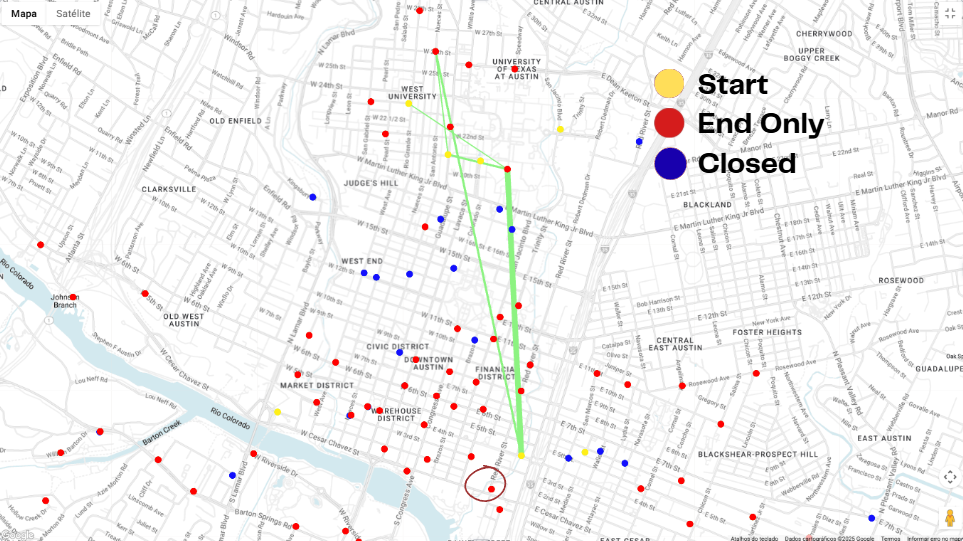

#  Zen City's Journey: A Data-Driven Strategy to Optimize Bike Rentals in Austin
> **Strategic Analysis for Operational Efficiency and Growth (Q2 2022)**

##  Project Overview
Developed in partnership with **Shimrit Peled** as a final project for the **Data Analytics Program at the Google and Reichman AI Tech School (2025)**, this repository presents a comprehensive investigation into bike-sharing operations in Austin, Texas. The primary goal was to identify operational bottlenecks and provide a data-backed strategy to increase rental volume for the upcoming quarter (Q2).

By combining SQL-based data exploration, statistical hypothesis testing, and geospatial mapping, we identified critical nodes of high demand and proposed actionable interventions for resource allocation.

---

##  Tools & Technologies
* **SQL (BigQuery):** Data extraction, complex joins (handling station metadata gaps), and KPI development.
* **BigQuery Geo Viz:** Geospatial visualization for mapping station density and analyzing urban trip distribution.
* **Google Sheets:** Statistical modeling and **Linear Regression** implementation for demand forecasting.
* **Advanced Statistics:** Hypothesis testing (**p-value: 0.0025**) to validate station utilization anomalies.

---

##  Geospatial Analysis (BigQuery Geo Viz)
Since bike-sharing is inherently spatial, I utilized **BigQuery Geo Viz** to map the network's behavior and identify usage patterns across Austin.

<p align="center">
  
  <br>
</p>

This analysis allowed for:
* **Visualizing Demand Clusters:** Identifying that the North-Central cluster (near the University) operates under significantly higher pressure than peripheral stations.
* **Identifying Supply Gaps:** Mapping the preferred routes of "Subscriber" users to propose the conversion of a low-performing end station into a high-utility start station.

---

##  Technical Challenges & Solutions

### 1. Data Integrity & Metadata Gaps
Identified that active station data was missing from static metadata tables (e.g., Station ID 4938). I implemented **Left Joins** and conditional logic to ensure trip logs were preserved, maintaining 100% data integrity for the rental analysis.

### 2. Validating System Bottlenecks
Calculated normalized utilization rates, discovering that the **Dean Keeton / Speedway** station operated at **2.8x the system-wide average**. A statistical **p-value of 0.0025** confirmed these peaks were structural capacity issues rather than random fluctuations.

### 3. Predictive Demand Modeling
Developed a linear regression model ($Y = 0.49X + 12.35$) to forecast daily trip volume. The model predicted a growth trend reaching approximately **57 trips/day** at primary bottleneck stations for the start of Q2.

---

##  Key Business Insights & Recommendations
* **Capacity Expansion:** Recommended increasing dock capacity at the Dean Keeton station from **17 to 22 units** to prevent "station full" events.
* **Operational Rebalancing:** Identified a critical operational window (**10:00 - 19:00, Monday to Friday**) where proactive bike rebalancing is required to maintain availability.
* **Infrastructure Pilot:** Proposed a pilot to convert solar-powered stations to **electric-grid power**, as data showed significantly higher availability and reliability at electric-powered hubs.
* **Network Strategy:** Suggested converting Station ID 4060 into a "Start Station" to better align with the preferred commuter routes of high-value subscribers.

---

##  Repository Structure
```text
├── sql/             # SQL scripts for data cleaning and KPI development.
├── models/          # Linear Regression and statistical significance calculations.
├── docs/            # Final Technical & Executive Report (PDF).
└── img/             # BigQuery Geo Viz maps and data visualizations.
